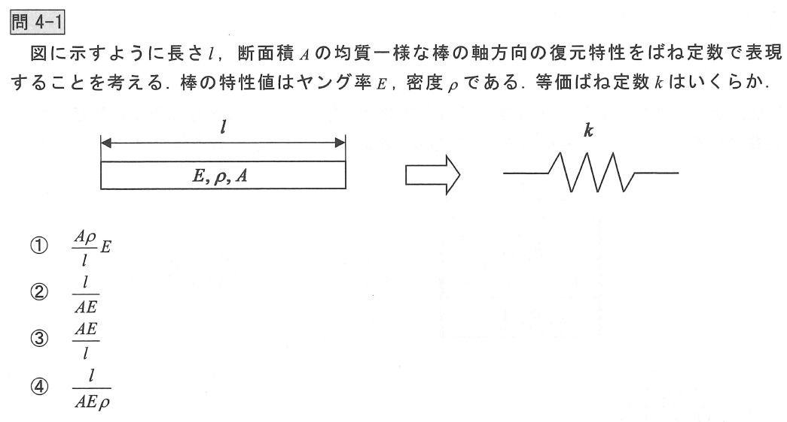
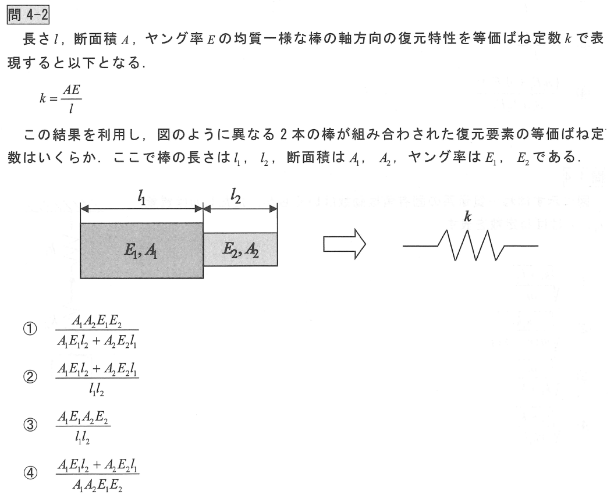

# 振動工学および音響工学の基礎

## 4-1

力のつり合いから考える
$$ F = ku $$
$$ \sigma A = k \varDelta l $$
$$ E \varepsilon A = k \varDelta l $$
$$ E \frac{\varDelta l}{l} A = k \varDelta l $$
$$ k = \frac{AE}{l} $$

直感的に考えると
- ヤング率が増加すると剛性が**上がる**
- 面積が増加すると剛性が**上がる**
- 長さが増加すると剛性が**下がる**

## 4-2

それぞれの棒にかかる力 $F$ は同じになり、4-1より考えると

$$
F = k(u_1+u_2) \\
k = \frac{F}{u_1+u_2} , \rightarrow
k = \frac{F}{\frac{F}{u_1}+\frac{F}{u_2}} \\
k = \frac{k_1k_2}{k_1+k_2}
$$
$$
k_1 = \frac{A_1E_1}{l_1} , \ k_2 = \frac{A_2E_2}{l_2}
$$
$$
K = \frac{A_1 E_1 A_2 E_2}{A_1E_1L_2+A_2E_2L_1}
$$

## 4-3

それぞれの棒にの変位 $u$ は同じになり、4-1より考えると

$$ 
F_1=ku_1, F_2=ku_2 \\
u_1 = u_2 = u \\
F_1+F_2 = k u \\
$$
$$
k = \frac{A_1E_1}{l} + \frac{A_2E_2}{l} \\
$$
$$
k = \frac{A_1E_1+A_2E_2}{l}
$$

## 4-4

固有角振動数は以下の式により求めることができる
$$
\omega_n = \sqrt{\frac{k}{m}} \quad [rad/sec]
$$
固有振動数は、固有角振動数を $2\pi$ で割ることで求めることができる
$$
f_n = \frac{1}{2\pi} \sqrt{\frac{k}{m}} \quad [Hz]
$$

4-2より直列バネのバネ定数は以下であるので代入する
$$
k = \frac{k_1k_2}{k_1+k_2}
$$
$$
\omega_n = \sqrt{\frac{k_1k_2}{m(k_1+k_2)}}
$$

## 4-5

### 固有振動数とは？
- 対象とする振動系が自由振動を行う際、その振動系に働く特有の振動のこと

[固有振動数 by Wikipedia](https://ja.wikipedia.org/wiki/%E5%9B%BA%E6%9C%89%E6%8C%AF%E5%8B%95)

4-4より並列バネのバネ定数は以下であるので代入する
$$
k = k_1+k_2
$$
$$
\omega_n = \sqrt{\frac{k_1+k_2}{m}}
$$

固有角振動数は以下の式により求めることができる
$$
\omega_n = \sqrt{\frac{k}{m}} \quad [rad/sec]
$$
固有振動数は、固有角振動数-を $2\pi$ で割ることで求めることができる
$$
f_n = \frac{1}{2\pi} \sqrt{\frac{k}{m}} \quad [Hz]
$$

## 4-6

並列を考えてから直列を考えると
$$
k_1 + k_1 = 2k_1
$$
$$
k = \frac{2k_1k_2}{2k_1+k_2}
$$

固有角振動数を求める
$$
\omega_n = \sqrt{\frac{2k_1k_2}{m(2k_1+k_2)}}
$$

## 4-7

水平の場合の運動方程式
$$ m\ddot{x} + kx = 0 $$

垂直の場合の運動方程式
$$
m\ddot{x} + kx = mg \\
m\ddot{x} + kx - mg = 0 \\
m\ddot{x} + k(x - mg/k) = 0 \\
y = x - mg/k \rightarrow x = y + mg/k \\
\therefore \ddot{x} = \ddot{y}
$$
$$ m\ddot{y} + ky = 0 $$

水平の時を同じ運動方程式となるので固有角振動数は同じとなり、
固有角振動数を表す $\omega_n=\sqrt{k/m}$ には剛性と質量のみが影響している

## 減衰がない場合の運動方程式について

減衰がない場合の運動方程式は以下のようになる
$$ m\ddot{x} + kx = 0 $$
これの解を $x = e^{\lambda t}$ とおいて2解微分を求める
$$ \ddot{x} = \lambda^2 e^{\lambda t} \\ $$
これらを運動方程式に代入する
$$ m\lambda^2 e^{\lambda t} + ke^{\lambda t} = 0 $$
$$ m\lambda^2 + k = 0 $$
方程式の解をもとめる
$$
\lambda_1 = \pm \sqrt{-\frac{k}{m}} , \quad 
\lambda_2 = \pm i\sqrt{\frac{k}{m}} \\
$$
$\lambda$ は２つあるのでそれぞれをもともとおいた解の式に代入する
$$
x_1 = e^{i\lambda t}, \ x_2 = e^{-i\lambda t}
$$
ここで、$x_1, \ x_2$ は線形独立のため一般解は以下のようになる
$$
x = A e^{i\lambda t} + B e^{-i\lambda t}
$$
オイラーの公式 $e^{i\theta} = \cos\theta + i\sin\theta$ を使って書き換えると
$$
x = A\{(\cos(\lambda t) + i\sin(\lambda t))\} + \{B(\cos(-\lambda t) + i\sin(-\lambda t))\}
$$
$$
x = A'\cos \lambda t + B' \sin \lambda t
$$
式をまとめて、初期条件 $x(0)=x_0, v(0)=v_0$ として積分定数を求め、
$\lambda$ を固有振動数 $\omega_n = \sqrt{k/m}$ と置き換える
$$
x = x_0\cos\omega_n t + \frac{v_0}{\omega_n}\sin\omega_n t
$$
sin のみに書き換えると以下のようになる
$$ x = \sqrt{x_0^2+\Big(\frac{v_0}{\omega_n}\Big)^2} \sin(\omega t  + \varphi), \quad \varphi = \tan^{-1}\frac{v_0}{x_0\omega} $$
cos のみに書き換えると以下のようになる
$$ x = \sqrt{x_0^2+\Big(\frac{v_0}{\omega_n}\Big)^2} \cos(\omega t  + \varphi), \quad \varphi = \tan^{-1}\frac{x_0\omega}{v_0} $$

この式により自由振動の振動を表すことができる

## 4-8

### 減衰がある場合の運動方程式について

減衰がある場合の運動方程式は以下のようになる
$$ m\ddot{x} + c\dot{x} + kx = 0 $$
これの解を $x = e^{\lambda t}$ とおいて1解微分と2解微分を求める
$$ \dot{x} = \lambda e^{\lambda t} \\ $$
$$ \ddot{x} = \lambda^2 e^{\lambda t} \\ $$
これらを運動方程式に代入する
$$ m\lambda^2 e^{\lambda t} + m\lambda e^{\lambda t} + ke^{\lambda t} = 0 $$
$$ m\lambda^2 + m\lambda + k = 0 $$
方程式の解をもとめる
$$
\lambda_1, \lambda_2 = \frac{-c\pm i \sqrt{4mk-c^2}}{2m}
$$
ここで、臨界減衰係数 $\zeta$ と 固有角振動数 $\omega_n$ を使って書き換える
$$
\zeta = \frac{c}{c_c} , \quad \omega_n = \sqrt{\frac{k}{m}} \rightarrow 
\lambda_1, \lambda_2 = \omega_n(\zeta \pm \sqrt{\zeta^2-1})
$$
$x_1, \ x_2$ は線形独立のため一般解は以下のようになる
$$
x = Ae^{\omega_n(\zeta+\sqrt{\zeta^2-1})} + Be^{\omega_n(\zeta-\sqrt{\zeta^2-1})}
$$

#### 過減衰 $\zeta>1$
$\zeta>1$ より $c^2 > 4mk$ なので $\lambda_1, \lambda_2$ は負の数となり振動は起こらない

#### 臨界減衰 $\zeta=1$
$\zeta=1$ より $c^2 = 4mk$ なので $\lambda_1 = \lambda_2$ となり運動方程式の解は以下となる
$$ x = (At + B)e^{\frac{c}{2m}t} $$
初期条件 $x(0)=x_0, v(0)=v_0$ として式を求める
$$ x = \{x_0 + (v_0+\omega_n x_0)t\}e^{-\omega_n t} $$
これは、$\sin, \cos$ がなく、振動をしない形となる

#### 不足減衰 $\zeta<1$
$\zeta<1$ より $c^2 < 4mk$ なので $\lambda_1, \lambda_2$ は複素数となり、減衰を考慮した減衰固有角振動数を求める
$$ \omega_d = \omega_n\sqrt{1-\zeta^2} $$
運動方程式の解は計算していくと減衰振動の式が得られる
$$
x = e^{-\zeta\omega_n t}(A\cos \omega_d t + B\sin \omega_d t)
$$
$$ x = e^{-\zeta\omega_n t} \sqrt{A^2+B^2}\sin(\omega_d t + \varphi) $$

初期条件 $x(0)=x_0, v(0)=v_0$ として積分定数を求める

$$
x = e^{-\zeta\omega_n t}  \sqrt{x_0^2+\frac{(v_0/\omega_n+\zeta x_0)^2}{1-\zeta^2}}\cos(\omega_d t - \varphi)
$$
$$
\varphi = tan^{-1}\frac{v_0/\omega_n+\zeta x_0}{x_0\sqrt{1-\zeta^2}}
$$

この式により減衰振動を表すことができる
