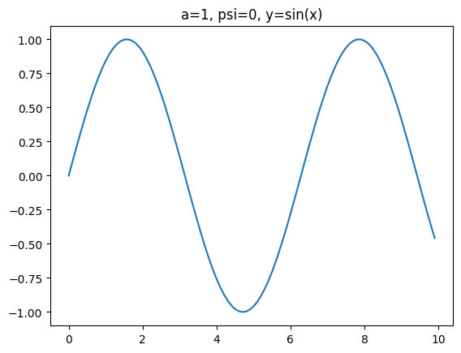
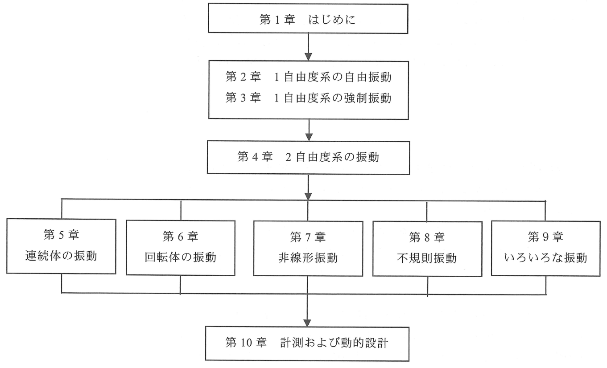

# 振動学

## はじめに
### 振動学とは？

- 振動とは
  - ある座標系で測定した物理量が、その平均値や基準値よりも大きい状態と小さい状態とを交互に繰り返す変化である
  - 機械工学における振動学は、機械振動を対象にしてきたが、現在では流体力や電磁力により生じる機械の振動はだけでなく、血圧変動などを含む広い分野の振動現象と係わるようになっている．
### どんな振動があるのだろうか
- 自由振動
  - 飛び込み板から人が飛び込んだ後に板に発生する振動などで、物体に作用する外力を取り除いた後に起こる振動
  - 物体は、その系に固有の振動数、固有振動数で振動する
- 強制振動
  - 車がでこぼこ道を走行するとき、上下振動を感じることがあり、この周期的な外力によって発生する継続的な周期振動
- 自励振動
  - 風による旗のはためきがある、また、黒板にある角度を持ってチョークを進ませると摩擦力によりチョークがカタカタと振動する
  - これらは、非周期的なエネルギーが継続的に供給されることにより生じる振動である
  - これによって物体が振動する振動数は、その物体の固有振動数である
- 係数励振振動
  - 張力が時間変動する弦の横振動、人が上下動することにより励振されるブランコ乗りなどがある
  - これらは物体の運動方向とは異なる方向の周期的変動力により物体が励振される振動
  - 係数励振によって物体が振動する振動数は、目励振動の場合と同様に、その物体の固有振動数である．
### 振動の用語
- 振動の基本式(単振動)
$$ y=a \sin(\omega t + \psi) $$
- 周期 $T \ [Hz]$、振動数 $f$、角振動数 $\omega \ [rad/s]$
$$ T = \frac{2\pi}{\omega} \ , \quad f = \frac{1}{T} $$

- 単振動の例

- 構成図

## 1自由度系の自由振動
### 1自由度振動系とは
- 機械や構造物で振動が生じると破壊や事故に至るおそれがあり、また破壊までに至らなくても騒音や振動で不快に感じることがあり、そのような場合には、系のメカニズムを知ることにより振動や騒音対策の手段を講ずることができる
- １自由度とは、系を構成する要素のひとつである質点あるいは剛体が１個であり、その位置あるいは角度などが一つの変数で表される系を意味する．
### 減衰のない 1自由度系の振動
#### バネ-質量系の運動方程式と解
$$ m\frac{d^2x}{dt^2} = -kx $$
$$ m \ddot{x} = -kx \rightarrow m \ddot{x} + kx = 0 $$
- 天井から吊り下げられたバネに質点をつけ上下に振動する場合
  - 質点の運動方程式
$$ m\ddot{X} = mg - kX $$
  - バネの伸び $X$ を釣合いの位置での伸び $x_s$、釣合いの位置からの伸び $x$ で表す
$$ X = x_s + x $$
  - バネの伸び $x_s$ は復元力と重力のつり合いより
$$ mg = kx_s $$
  - $\ddot{X}=\ddot{x}$ であるので
$$ m\ddot{x} = mg - k(x_s + x) = -kx $$

このように最初の式と同じになり、質点に重力が働いている場合でも、釣合いの位置を原点にとれば、重力を考慮せずに運動方程式を立てた場合と同じになる．

- 一般解を求める
  - 式の両辺に $\dot{x}$ を掛ける
$$ \frac{d}{dt} \Big( \frac{m}{2}\dot{x}^2 + \frac{k}{2}x^2 \Big) $$
  - 積分する
$$ \frac{m}{2}\dot{x}^2 + \frac{k}{2}x^2 = const. = E $$
  この式は、「運動エネルギーとバネによる弾性エネルギーを合わせた系全体のエネルギーは一定であり、エネルギーが保存されている」ことを示している
  - さらに、$\dot{x}=$ の形に変形する
$$ \dot{x} = \pm \sqrt{\frac{2E}{m}-\frac{k}{m}x^2} = \pm \sqrt{\frac{2E}{m} \Big(1-\frac{k}{2E}x^2}\Big) $$
  - さらに、$x, \dot{x}$ を以下のようにおく
$$ x = \sqrt{\frac{2E}{k}}\sin\theta \ , \quad
\dot{x} = \sqrt{\frac{2E}{k}} \dot{\theta} \cos\theta $$
  - $\dot{\theta}$ を求める
$$ \dot{\theta} = \pm \sqrt{\frac{k}{m}} $$
  - これらにより $x$ の一般解は以下のように求められる
$$ x = \sqrt{\frac{2E}{k}\sin\Big(\pm\sqrt{\frac{k}{m}}t+\alpha\Big)}
= A\sin \omega_n t + B\cos\omega_n t $$
  - ここで、$\omega_n = \sqrt{k/m} = \sqrt{g/x_s}$ である

- 固有角振動数 $\omega_n$
  - $\omega_n$ は振動系に固有の値であり、自由振動ではこの振動数で振動するので固有角振動数と呼ばれる
- $A,B$ は積分定数であり、初期条件により決まる
- 固有周期 $T$
  - この振動の周期を固有周期といい $T=2\pi / \omega_n$ で求められる

この解 $ｘ$ は $0$ を中心に振動しており、振動系について次のこ
とが説明できる
- 釣合いの位置が振動の中心(これを平衡点という)となる
- 重力の影響を受ける上下振動の場合でも釣合いの位置を原点として式を立てると運動方程式の式で表され、解も一般解として表されるので、やはり釣合いの位置を平衡点として振動する

例題1 : $t=0$ で $×=0, \dot{x}=v_0$ であるときの振動を求めよ
- 振動 $x$ の一般解とそれを微分した式
$$ x = A \sin \omega_n t + B \cos \omega_n t $$
$$ \dot{x} = A \omega_n \cos \omega_n t - B \omega \sin \omega_n t $$
- 初期条件を適用
$$ t=0, x=0 \rightarrow 0 = A \sin(0) + B \cos(0) \ \because B=0 $$
$$ t=0, \dot{x} = v_0 \rightarrow v_0 = A \omega_n \cos(0) - B \omega_n \sin(0) \ \because A=v_0/\omega_n $$
- 上記の結果を一般解に代入
$$ 
x = \frac{v_0}{\omega_n} \sin \omega_n t + 0 \cos \omega_n t \rightarrow
x = \frac{v_0}{\omega_n} \sin \omega_n t
$$

以上より、振幅 $v_0/\omega_n$ のsin波となる

例題2 : $t=0$ で $×=x_0, \dot{x}=0$ であるときの振動を求めよ
$$ x = x_0 \cos \omega_n t $$

例題3 : $t=0$ で $×=x_0, \dot{x}=v_0$ であるときの振動を求めよ
$$ x = v_0/\omega_n \sin \omega_n t + x_0 \cos \omega_n t $$

例題の解をみてわかるように、例題3の場合の解は、例題1の解と例題2の解の和になっている
また、初期条件も同じように、二つの初期条件の和になっている
このような性質を線形といい、微分方程式が線形であると同時に振動についても線形振動であるという

#### さまざまな振動モデル

- ねじり振動
$$ J_G \ddot{\theta} + k \theta = 0 $$
- 実体振り子
$$ J_P \ddot{\theta} + mgh \sin\theta = 0 \rightarrow J_P \ddot{\theta} + mgh\theta = 0 $$
- 慣性モーメント
  - 質量が無視できる長さ $l$ の棒の先に質量 $m$ の質点がついた系の点 $O$ 周りの慣性モーメント
$$ J_O = ml^2 $$
  - 長さ $l$ 質量 $m$ の一様な棒の慣性モーメント
    - 重心 $G$ まわり

### エネルギー法による固有振動数の計算法

これまで考えてきた振動の解法について考えてみる。
運動方程式である微分方程式の解が求められれば良いが、解を求めるのが困難な運動方程式や、
ときには解を求めなくても振動系の特性だけを求めればよい場合がある。
例えば、固有振動数だけを求めたい場合は、エネルギー法（レイリ一法） を用いると便利なことが多い。

#### バネｰ質量系(水平)
エネルギー法では自由振動している場合のエネルギー保存則を利用して固有振動数を求める
- 全体のエネルギーを運動エネルギー + バネの弾性エネルギー = 一定
$$ E = \frac{1}{2} mv^2 + \frac{1}{2} kx^2 = Const. $$
- バネが自然長のときの質点の位置を原点にとり変位を仮定
$$ x = A \sin \omega_n t \rightarrow \dot{x} = A\omega_n \cos \omega_n t $$
- 平衡点を通過中のとき
$$ E = \frac{1}{2} (A\omega_n)^2 + 0 $$
- バネの伸びが最大の時
$$ E = 0 + \frac{1}{2} kA^2 $$
- エネルギーが保存されていることより
$$ \frac{1}{2} (A\omega_n)^2 =  \frac{1}{2} kA^2 \rightarrow \omega_n = \sqrt{\frac{k}{m}} $$

#### バネｰ質量系(垂直)
ばねが垂直の場合、質点の位置エネルギーが加えられ、最下点(最上点)を使って計算する
- 全体のエネルギー = 一定
$$ E = \frac{1}{2} mv^2 + \frac{1}{2} kx^2 + mgh = Const. $$
- 平衡点を通過中のとき
$$ E = \frac{1}{2} (A\omega_n)^2 + \frac{1}{2} kA^2 + 0 $$
- 最下点では
$$ E = 0 + \frac{1}{2} k(x_s + A)^2 - mgh = \frac{1}{2} k(x_s^2 + A^2) $$
- エネルギーが保存されていることより
$$ \omega_n = \sqrt{\frac{k}{m}} $$
#### 振り子の振動
振り子の場合、考えるエネルギーは運動エネルギーと位置エネルギーの和である位置エネルギーの基準を振り子の最下点（平衡点）にとり式で表す
$$
E = \frac{1}{2}J_P\dot{\theta}^2 + mgh(1-\cos\theta)
$$
- 振り子の角度を $\theta = \alpha\sin\omega_nt$ として
- 平衡点では
$$ E = \frac{1}{2}J_P(\alpha\omega_n)^2 + 0 $$
- 一番右に触れた位置では、$\theta = \alpha, \dot{\theta} =0$ より
$$ E = 0 + mgh(1-\cos\theta) $$
- エネルギーが保存されていることより
$$ \omega_n = \sqrt{\frac{mgh}{J_P}} $$

### 減衰のある 1自由度系の振動
減衰振動とは、時間とともに振幅が小さくなっていく振動のことで、粘性減衰振動、摩擦減衰振動などがある。不減衰振動とは、減衰のない振動のことをいう

- 運動方程式
$$ m\ddot{x} + c\dot{x} + kx = 0 $$
- 運動方程式の解を $x=Ae^{\lambda t}$ とおくと $\lambda$ は $m\lambda^2+c\lambda + k =0$ の解となり以下のように求めることができる
$$ \lambda = \frac{-c\pm \sqrt{c^2-4mk}}{2m} $$
- 運動方程式の解は $A, B$ は積分定数として以下となる
$$ x = Ae^{\lambda_1 t} + Be^{\lambda_2 t} $$
$\lambda$ の中の $\sqrt{c^2-4mk}$ の正負により減衰の状態が分けられる

#### 過減衰
$c^2 > 4mk$ のとき $\lambda_1, \lambda_2$ は負の数となり振動は起こらない

#### 不足減衰
$c^2 < 4mk$ のとき $\lambda_1, \lambda_2$ は複素数となるので
$$ \lambda_1, \lambda_2 = -\frac{c}{2m}\pm i \omega_d \ , \ \omega_d = \sqrt{\frac{4mk-c^2}{2m}} $$
- 運動方程式の解は計算していくと減衰振動の式が得られる
$$ x = \sqrt{A'^2+B'^2}e^{\frac{c}{2m}t} \sin(\omega_d t + \varphi)$$

#### 臨界減衰
$c^2 = 4mk$ のとき $\lambda_1 = \lambda_2$ で運動方程式の解は
$$ x = (At + B)e^{\frac{c}{2m}t} $$

以上より、$c < 2\sqrt{mk}$ のとき振動がおこり、この値を臨界減衰係数と呼び、$c_c$ を表記する。また、減衰係数 $c$ と臨界減衰係数 $c_c$ の比を減衰比といい、$\zeta=c/c_c$ で表す

- 過減衰
$$ \zeta > 1 $$
- 臨界減衰
$$ \zeta = 1 $$
- 不足減衰
$$ \zeta < 1 $$

減衰固有角振動数ｗｄと減衰のない場合の固有角振動数山の関係は、
$\omega_d = \omega_n\sqrt{1-\zeta^2} $のように表され、減衰がある場合は減衰のない場合に比べて固有角振動数が小さくなる
しかし、実際の構造物の減衰比は小さいので、減衰による固有振動数低下は非常に小さい

#### 対数減衰率

### 固体摩擦のある場合の1自由度系の振動

### ラグランジュの運動方程式

## 1自由度系の強制振動
### 強制振動とは
### 運動方程式
### 定常応答と共振特性
#### 共振特性
#### 共振特性
#### 共振特性を用いた減衰係数の道程
### 強制振動における仕事
### 振動の伝達
### 多重周期振動
### 過渡応答

## 2自由度系の自由振動
### はじめに
### 運動方程式
### 固有振動数と固有振動モード
### 自由振動の解
### モード座標とモードの直行性
### 強制振動
### 動吸振器
### モード解析
### ラグランジュの運動方程式
### N自由度系の自由振動

## 連続体の振動
### 2自由度系から連続体へ
### 棒の縦振動
### 針の曲げ振動(横振動)
### 平板の曲げ振動(横振動)
### エネルギーによる連続体の考察
### その他の連続体の問題
### まとめ

## 回転体の振動
### 回転軸のふれ回り
### 回転軸のねじり振動
### 釣合わせ

## 非線形振動
### どのような場合に非線形振動が現れるか？
### 非線形自由振動
### 非線形強制振動
### 非線形連成振動
### 実際の機械システムにおける非線形振動

## 不規則振動
### 不規則振動とは
### 確率の基礎
### 相関関数とスペクトル密度
### 線形系の不規則振動

## いろいろな振動 - 自励、係数励振、カオス振動
### 自励振動
### 係数励振振動
### カオス振動

## 計測および動的設計 
### 実機における振動問題
### 実問題における計測
### 振動解析と動的設計
### 
### 
### 
### 